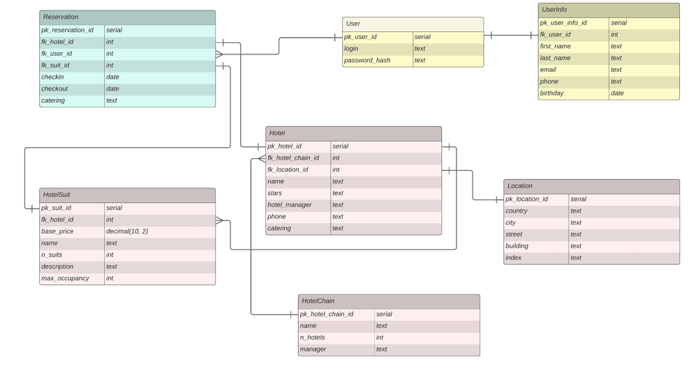
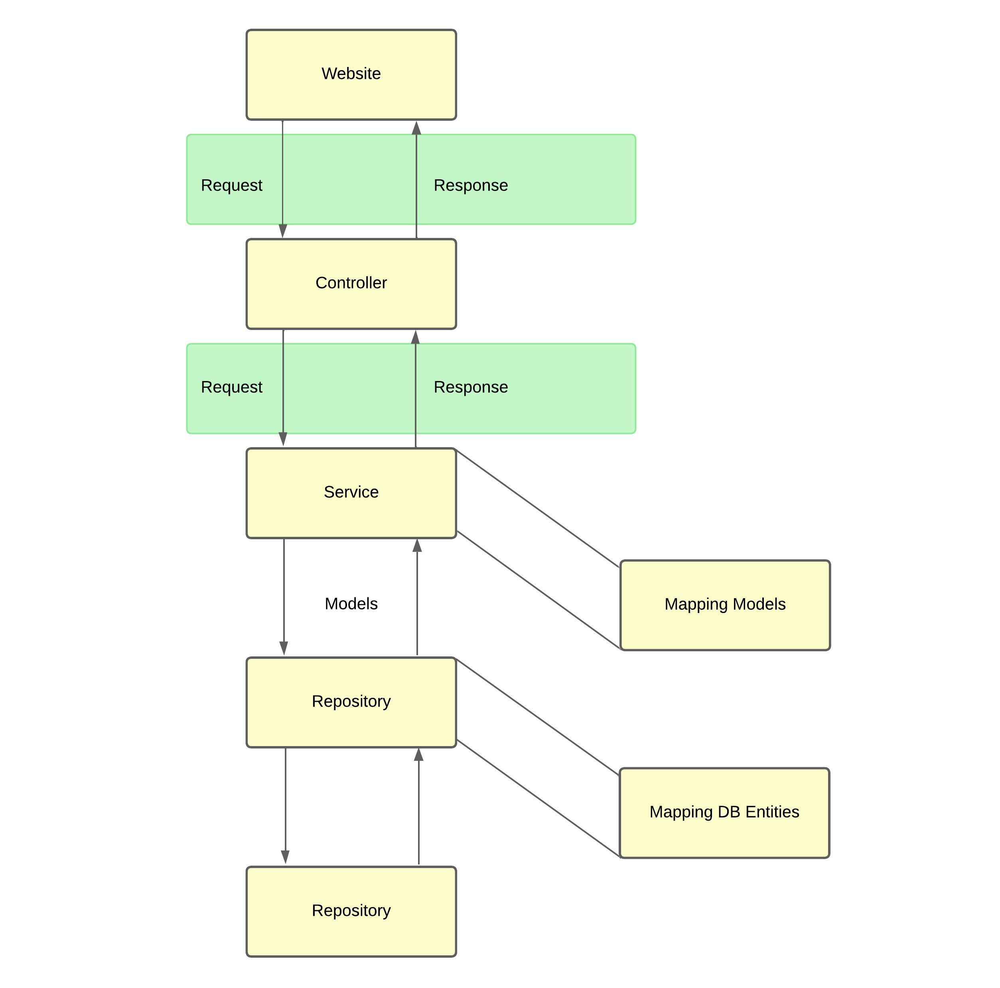

# Сервис  онлайн-бронирования для отелей и гостиниц

## ERD диаграмма



## Общий pipeline сервиса



## Спецификация API

### Hotels

```
Получить информацию по отелю - GET api/v1/hotels/{hotelId}
request - `{ "hotel_id": 1 }`
response - `{"status": "success", "data":  { "hotel_id": 1, "hotel_chain_id": 1, "location_id": 1, "name": "Ritz Moscow Arbat", "stars": "5", "hotel_manager": "Oxana Leonenko", "phone": "8(495)225-81-81", "catering": ["breakfast", "lunch", "dinner"] } }`
```

```
Удалить отель - DELETE api/v1/hotels/{hotelId}
request - `{ "hotel_id": 1 }`
response - `{ "status": "success" }`
```

```
Получить информацию о цепочке отелей - GET api/v1/hotel_chains/{hotelChainId}
request - `{ "hotel_chain_id": 1 }`
response - `{ "status": "success", "data": { "hotel_chain_id": 1, "name": "Ritz Carlton", "hotel_number": 115, "hotel_chain_manager": "Herve Humler" } }`
```

```
Удалить цепочку отелей - DELETE api/v1/hotel_chains/{hotelChainId}
request - `{ "hotel_chain_id": 1 }`
response - `{ "status": "success" }`
```

```
Создать отель - POST api/v1/hotels
request - `{ "hotel_chain_id": "1" , "hotel_name": "Ritz Moscow Arbat" , "stars": "5", "hotel_manager": "Oxana Leonenko", "phone": "8(495)225-81-81", "catering": [ "breakfast", "lunch", "dinner" ] , "country": "Russia", "city": "Moscow", "street": "Tverskaya St.", "building_number": "3", "index": "125009" }`
response - `{ "status": "success", "data": { "hotel_id": 1} }`
```

```
Обновить отель - PUT api/v1/hotels
request - `{ "hotel_id": 1, "location_id": 1, "name": "Ritz Moscow Arbat", "stars": "5", "hotel_manager": "New Manager Name", "phone": "8(495)225-81-81", "catering": [ "breakfast", "lunch", "dinner" ] }`
response - `{ "status": "success" }`
```

```
Создать цепочку отелей - POST api/v1/hotel_chains
request - `{ "name": "Ritz Carlton", "hotel_chain_manager": "Herve Humler", "hotel_number": 115 }`
response - `{ "status": "success", "data": { "hotel_chain_id": 1 } }`
```

```
Обновить цепочку отелей - PUT api/v1/hotel_chains
request - `{ "hotel_chain_id": 1, "hote_chain_name": "Ritz Carlton", "hote_number": 100, "hotel_chain_manager": "New Manager Name" }`
response - `{ "status": "success" }`
```

```
Получить список всех цепочек отелей - GET api/v1/hotel_chains
request - `{}`
response - `{ "status": "success", "data": [ "hotel_chain_id": 1,  "hotel_chain_id": 2, "hotel_chain_id": 3] }`
response - `{ "status": "success", "data": [ { "hotelChainId": 1, "name": "Крутой отель", "hotelNumber": 234, "hotelChainManager": "Андрей" },  { "hotelChainId": 3, "name": "Малая Посадская 15б Алко Отель", "hotelNumber": 1, "hotelChainManager": "string" } ] }`
```

```
Получить список отелей по выбранным критериям  - GET api/v1/hotels/range
request - `{ "city": "Moscow", "stars": 5, "catering": [ "breakfast" ], price_limit: 30000.00, "date_in": "2024-03-12T14:00:00.000Z", "date_out": "2024-03-18T12:00:00.000Z" }`
response - `{ "status": "success", "data": [ { "hotel_id": 1, "hotel_chain_id": 1, "location_id": 1, "name": "Ritz Moscow Arbat", "stars": "5", "hotel_manager": "Oxana Leonenko", "phone": "8(495)225-81-81", "catering": [ "breakfast" ] } ] }`
```

```
Получить список комнат по выбранным критериям - GET api/v1/hotels/{id}/rooms
request - `{"hotel_id": 1, "occupancy": 4, """date_in": "2024-03-12T14:00:00.000Z", "date_out": "2024-03-18T12:00:00.000Z"}`
response - `{"status": "success", "data": [ { "suit_id": 1, "hotel_id": 1, "name": "superior", "base_price": 44000.00, "n_suits": 100, "description": "description", "max_occupancy": 4 }, { "suit_id": 2, "hotel_id": 1, "name": "deluxe", "base_price": 46400.00, "n_suits": 75, "description": "description", "max_occupancy": 4 } ] }`
```

### Reservation

```
Создать бронирования - POST api/v1/hotels/book
request - `{ "user_id": 1, "hotel_id": 1, "suite_id": 1, "date_in": "2024-03-12T14:00:00.000Z", "date_out": "2024-03-18T12:00:00.000Z", "catering": [ "breakfast" ] }`
response - `{"status": "success", data: { "reservation_id": 1 } }`
```

```
Удалить бронирование - DELETE api/v1/reservations
request - `{ "reservation_id": 1 }`
response - `{ "status": "success" }`
```

```
Получить информацию о бронировании - GET api/v1/reservations/{reservationId}
request - `{ "reservation_id": 1 }`
response - `{ "status": "success", "data": { "reservation_id": 1, " hotel_id": 1, "user_id": 1, "suite_id": 1, "date_in": "2024-03-12T14:00:00.000Z", "date_out": "2024-03-18T12:00:00.000Z", "catering": ["breakfast"] } }`
```

### Suites

```
Создать тип номера в отеле - POST api/v1/hotel_suite_types
request - `{ "hotel_id": 1, "name": "Standard Room", "base_price": 100, "n_suits": 10, description": "Basic room with essential amenities", "max_occupancy": 2 }`
response - `{ "status": "success", "data": { "suite_id": 1 } }`
```

```
Обновить информацию о типе номера в отеле - PUT api/v1/hotel_suite_types
request - `{ "suite_id": 6, "name": "Standard Room", "base_price": 2, "n_suits": 3, description": "Basic room with essential amenities", "max_occupancy": 4 }`
response - `{ "status": "success"} `
```

```
Получить список всех типов номеров - GET api/v1/hotel_suite_types
request - `{}`
response - `{"status": "success", "data": [ { "suit_id": 1, "hotel_id": 1, "name": "superior", "base_price": 44000.00, "n_suits": 100, "description": "description", "max_occupancy": 4 }, { "suit_id": 2, "hotel_id": 1, "name": "deluxe", "base_price": 46400.00, "n_suits": 75, "description": "description", "max_occupancy": 4 } ] }`
```

```
Получить информацию о типе номера в отеле - GET api/v1/hotel_suite_types/{suiteId}
request - `{ "suite_id": 6 }`
response - `{ "status": "success", "data": { "suite_id": 1, "hotel_id": 1, "name": "Standard Room", "base_price": 100, "n_suits": 10, description": "Basic room with essential amenities", "max_occupancy": 2 } }`
```

```
Удалить тип номера в отеле - DELETE api/v1/hotel_suite_types/{suiteId}
request - `{ "suite_id": 6 }`
response - `{ "status": "success" }`
```

### User

```
Получить информацию о пользователе - GET api/v1/users/{id}
request - `{ "user_id": 1 }`
response - `{ "status": "success" , "data": { "user_info_id": 4, "user_id": 4, "first_name": "Димка", "last_name": "Красавец", "email": "4@bk.ru", "phone": "85794678", "passport_hash": "31425678", "birthday": "2024-03-16T00:00:00" } }`
```

```
Удалить аккаунт - DELETE api/v1/users
request - `{ "user_id": 1 }`
response - `{ "status": "success" }`
```

```
Создать аккаунт - POST api/v1/users
request - `{ "login": "test", "password_hash": "qwerty123", "first_name": "Serge", "last_name": "Ovkovetz", "phone": "7904542947", "email": "test@gmail.com", "birthday": "2001-01-01", "passport": "2291124142" }`
response - `{ "status": "success", "data" : { "user_id": 1 } }`
```

```
Изменить данные аккаунта - PUT api/v1/users
request - `{ "user_id": 1, "login": "test", "password": "qwerty123", "first_name": "Serge", "last_name": "Ovkovetz", "phone": "7904542947", "email": "test@gmail.com", "birthday": "2001-01-01", "passport": "2291124142" }`
response - `{ "status": "success" }`
```